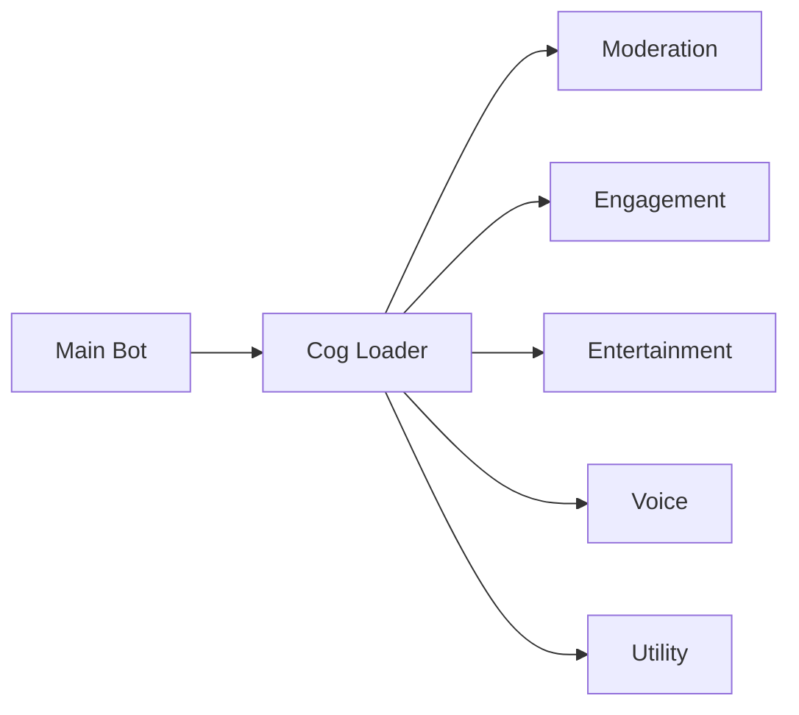

<div align="center">


# 🤖 Poison Bot - Feature-Rich Discord Server Management

[](https://www.python.org/downloads/)
[](https://github.com/Rapptz/discord.py)
[](LICENSE)
[](https://github.com/yourusername/yourrepo/graphs/commit-activity)

*A powerful, modular Discord bot with extensive server management and engagement features*

[Features](#-features) • [Installation](#-installation) • [Configuration](#-configuration) • [Commands](#-commands) • [Contributing](#-contributing)

</div>

---

## 📋 Overview

> **A next-generation Discord bot engineered for excellence**

This is a comprehensive Discord bot built with discord.py, featuring a modular cog-based architecture for easy maintenance and scalability. Designed with performance and reliability in mind, the bot includes advanced features for server management, user engagement, moderation, and entertainment.

### 🎯 Why Choose This Bot?

- 🚀 **High Performance** - Optimized async operations with minimal latency
- 🔧 **Modular Design** - 25+ independent cogs for maximum flexibility
- 🛡️ **Production Ready** - Built-in error handling and logging
- 🎨 **Highly Customizable** - Easy configuration for your server's needs
- 📊 **Resource Efficient** - Automatic memory management and cleanup

## ✨ Features

### 🛡️ Moderation & Management

<table>
<tr>
<td width="50%">

- 🔐 **Verification System** - Secure member verification with customizable workflows
- 🤖 **Auto Moderation** - Automated content filtering and rule enforcement
- 🔇 **Quarantine System** - Advanced mute system with jail channel and case tracking
- 📨 **Appeal System** - Modern appeal workflow with Discord modals and buttons

</td>
<td width="50%">

- 🗑️ **Purge Commands** - Bulk message deletion with advanced filters
- 🔨 **Ban Management** - Enhanced ban/unban functionality with logging
- ⏰ **Temporary Mutes** - Time-based mutes with auto-unmute functionality
- 📋 **Case Management** - Track and review moderation cases with appeal integration

</td>
</tr>
</table>

### 👥 User Engagement

<table>
<tr>
<td width="50%">

- 💤 **AFK System** - Automatic AFK status tracking with custom messages
- 🤫 **Confession System** - Anonymous confession channel management
- 🤖 **Auto Responder** - Custom automated responses to keywords

</td>
<td width="50%">

- 📌 **Sticky Messages** - Pin important messages that stay visible
- 🔍 **Snipe Commands** - Recover recently deleted/edited messages

</td>
</tr>
</table>

### 🎮 Entertainment & Games

<table>
<tr>
<td width="50%">

- 🎯 **Match Making** - Advanced matchmaking system for gaming
- 🎁 **Giveaways** - Feature-rich giveaway management

</td>
<td width="50%">

- 💎 **Drops** - Random reward drops for active members
- 📢 **Bulk Ping** - Mass mention system with cooldowns

</td>
</tr>
</table>

### 🎤 Voice Channel Features

<table>
<tr>
<td width="50%">

- 🎙️ **VC Manager** - Dynamic voice channel creation and management
- 🎭 **VC Roles** - Automatic role assignment based on VC activity

</td>
<td width="50%">

- 🔊 **Always VC** - Persistent voice channel monitoring
- 🎵 **Drag Me** - Voice channel movement commands

</td>
</tr>
</table>

### 🎨 Utility & Customization

<table>
<tr>
<td width="50%">

- 🖼️ **Avatar Commands** - Display and manipulate user avatars
- 🌟 **Status Changer** - Dynamic bot status rotation
- 🌐 **Translation** - Multi-language translation support
- 📸 **Media Commands** - Image and media manipulation
- 🧵 **Thread Management** - Advanced thread creation and control

</td>
<td width="50%">

- ℹ️ **Info Commands** - Server and user information display
- 📊 **Stats Tracking** - Comprehensive server statistics
- 😎 **Steal Emojis** - Copy emojis from other servers
- 👋 **Greeting System** - Welcome and goodbye messages
- 🎫 **Request Role** - User-initiated role requests

</td>
</tr>
</table>

## 🚀 Installation

### Prerequisites

```diff
+ Python 3.8 or higher
+ pip (Python package manager)
+ A Discord Bot Token
```

> 💡 **Get your Discord Bot Token** at [Discord Developer Portal](https://discord.com/developers/applications)

### Step 1: Clone the Repository
```bash
git clone https://github.com/lucxifvrrr/poison-bot.git
cd poison-bot
```

### Step 2: Install Dependencies
```bash
pip install -r requirements.txt
```

### Step 3: Configure Environment Variables
Create a `.env` file in the root directory:
```env
DISCORD_TOKEN=your_discord_bot_token_here
WEBHOOK_URL=your_webhook_url_here
MONGO_URL=mongodb://localhost:27017/  # For quarantine/appeal system
```

### Step 4: Run the Bot
```bash
python main.py
```

### Step 5: Setup Quarantine System (Optional)
If you want to use the quarantine and appeal system:

1. **In Discord**, run `/setup-mute` to initialize the system
2. Run `!setmodrole @YourModRole` to set the moderator role
3. The system will create:
   - 🔇 **Muted** role
   - 🔒 **jail** channel (for muted users)
   - 📝 **punishment-logs** channel (for moderation logs)

## ⚙️ Configuration

### Environment Variables
| Variable | Description | Required |
|----------|-------------|----------|
| `DISCORD_TOKEN` | Your Discord bot token | ✅ Yes |
| `WEBHOOK_URL` | Webhook URL for error reporting | ✅ Yes |
| `MONGO_URL` | MongoDB connection URL for quarantine/appeal system | ✅ Yes* |

*Required only if using the quarantine/appeal system

### Bot Intents
The bot requires the following intents:
- `members` - For member tracking and verification
- `presences` - For status monitoring
- `message_content` - For command processing

### Directory Structure
```
├── cogs/              # Bot command modules
│   ├── giveaways/    # Giveaway system
│   ├── quarantine/   # Quarantine & Appeal system
│   │   ├── quarantine_system.py  # Mute/jail management
│   │   ├── appeal_system.py      # Appeal workflow
│   │   ├── config.py              # System configuration
│   │   └── README.md              # Detailed documentation
│   └── *.py          # Individual cog files
├── logs/              # Auto-generated log files
├── database/          # Database storage
├── main.py            # Bot entry point
├── requirements.txt   # Python dependencies
├── .env              # Environment variables (create this)
└── .gitignore        # Git ignore rules
```

### 📝 Commands

### Prefix Commands
- `.ping` - Check bot latency and response time (Shows green dot status with ms)
- `.sync` - Manually sync slash commands (Owner only)

### Slash Commands
The bot includes numerous slash commands across all cogs. Use `/` in Discord to see all available commands with descriptions.

### Command Categories
- **Moderation**: Ban, kick, purge, verification, quarantine, appeals
- **Utility**: Avatar, info, stats, translate
- **Fun**: Confess, drops, giveaways
- **Voice**: VC management, roles, drag
- **Engagement**: AFK, auto-responder, sticky messages

### Featured: Quarantine & Appeal System
The bot includes a comprehensive quarantine system with an integrated appeal workflow:

**Setup Commands:**
- `/setup-mute` - Initialize the quarantine system (creates roles and channels)
- `!setmodrole <role>` - Set the moderator role

**Moderation Commands:**
- `!qmute <user> [duration] [reason]` - Mute a user (e.g., `!qmute @user 1h spam`)
- `!qunmute <user>` - Unmute a user
- `!mutelist` - View all currently muted members
- `!case <case_id>` - View details of a specific case
- `!jailhistory <user>` - View messages from muted user

**User Commands:**
- `/appeal <case_id>` - Submit an appeal using a modern modal interface
- `/appeal-status [appeal_id]` - Check your appeal status

**Moderator Commands:**
- `/appeal-list` - View all pending appeals
- `/appeal-review <appeal_id>` - Review appeal with interactive buttons

> 📖 For detailed documentation, see `cogs/quarantine/README.md`

## 🏗️ Architecture

### Modular Cog System



The bot uses a modular architecture where each feature is implemented as a separate cog. This allows for:

- ✅ Easy feature addition/removal
- ✅ Independent testing and debugging
- ✅ Clean code organization
- ✅ Hot-reloading capabilities

### 🔑 Key Features

| Feature | Description |
|---------|-------------|
| ⏱️ **Global Cooldown System** | Prevents command spam with intelligent rate limiting (1 command per 0.2s per user) |
| 🚫 **Duplicate Response Prevention** | Avoids double responses with tracking system (5-minute cleanup interval) |
| 📡 **Automatic Error Reporting** | Webhook-based error notifications for monitoring |
| 🛑 **Graceful Shutdown** | Proper cleanup on exit with signal handlers |
| 🧹 **Periodic Resource Cleanup** | Automatic memory management every 5 minutes |
| 📝 **Rotating Log Files** | Automatic log rotation with 7-day retention |
| 🔄 **Smart Command Sync** | Efficient command sync with rate limit handling and caching |
| 🎨 **Pretty Terminal Output** | Colorful terminal display with command listing and status |

## 🛠️ Development

### Adding New Cogs
1. Create a new Python file in the `cogs/` directory
2. Implement your cog class extending `commands.Cog`
3. Add the `setup()` function at the end
4. The bot will automatically load it on startup

Example:
```python
from discord.ext import commands

class MyCog(commands.Cog):
    def __init__(self, bot):
        self.bot = bot
    
    @commands.command()
    async def mycommand(self, ctx):
        await ctx.send("Hello!")

async def setup(bot):
    await bot.add_cog(MyCog(bot))
```

### Logging
- Only errors are logged by default
- Logs rotate daily and keep 7 days of history
- Location: `logs/bot.log`

## 🤝 Contributing

<div align="center">

### We Love Contributions! 💖

</div>

Contributions are welcome! Please follow these steps:

```bash
# 1. Fork the repository
# 2. Create a feature branch
git checkout -b feature/AmazingFeature

# 3. Commit your changes
git commit -m 'Add some AmazingFeature'

# 4. Push to the branch
git push origin feature/AmazingFeature

# 5. Open a Pull Request
```

### 📋 Contribution Guidelines

- 🐛 Report bugs with detailed reproduction steps
- 💡 Suggest features with clear use cases
- 📝 Update documentation for any changes
- ✅ Ensure code follows existing style patterns
- 🧪 Test your changes thoroughly

## 📜 License

This project is licensed under the MIT License - see the [LICENSE](LICENSE) file for details.

## 🐛 Bug Reports

If you encounter any bugs or issues, please:
1. Check existing issues first
2. Create a new issue with detailed information
3. Include error logs if applicable

## 💡 Support

<div align="center">

### Need Help? We're Here! 🙋‍♂️

</div>

| Method | Link |
|--------|------|
| 📖 **Documentation** | Check the README and code comments |
| 🐛 **Bug Reports** | [Open an Issue](https://github.com/lucxifvrrr/poison-bot/issues) |

## 🙏 Acknowledgments

<div align="center">

### Built With Amazing Technologies 🚀

[](https://www.python.org/)
[](https://github.com/Rapptz/discord.py)
[](https://github.com/aio-libs/aiohttp)

</div>

- 🐍 **Python 3.8+** - Modern async/await syntax
- 🤖 **discord.py** - Powerful Discord API wrapper
- 🌐 **aiohttp** - Async HTTP client/server framework
- 🎨 **Pillow** - Image processing capabilities
- 🗄️ **MongoDB & PyMongo** - Database for quarantine/appeal system
- 🗄️ **aiosqlite & motor** - Async database operations
- 🌍 **deep-translator** - Multi-language support

---

<div align="center">

### ⭐ Star this repository if you find it helpful! ⭐

<br>

[


<br>

### Made with ❤️ and ☕ by **.lucxifvr**

[](https://github.com/lucxifvrrr)

*Crafting powerful Discord bots, one commit at a time* ✨

</div>
