<div align="center">


# 🤖 Poison Bot

### *Feature-Rich Discord Server Management*

[](https://www.python.org/downloads/)
[](https://github.com/Rapptz/discord.py)
[](https://www.mongodb.com/)
[](LICENSE)
[](https://github.com/vasud3v/poison/graphs/commit-activity)

**30+ Cogs • 100+ Commands • 50+ Features**

[Features](#-features) • [Quick Start](#-quick-start) • [Commands](#-commands) • [Documentation](#-documentation)

</div>

---

## 📊 Feature Overview

```mermaid
graph TD
    A[Poison Bot] --> B[🛡️ Moderation]
    A --> C[📊 Activity Tracking]
    A --> D[👥 Engagement]
    A --> E[🎤 Voice Management]
    
    B --> B1[Verification System]
    B --> B2[Quarantine & Appeals]
    B --> B3[Ban Management]
    B --> B4[Purge Commands]
    
    C --> C1[Chat Leaderboard]
    C --> C2[Voice Leaderboard]
    C --> C3[Counting Game]
    C --> C4[Skullboard]
    
    D --> D1[AFK System]
    D --> D2[Confessions]
    D --> D3[Auto Responder]
    D --> D4[Giveaways]
    
    E --> E1[VC Manager]
    E --> E2[VC Roles]
    E --> E3[Summon System]
    E --> E4[Voice Controls]
```



## ✨ Features

<table>
<tr>
<td width="50%">

### 🛡️ Moderation
- **Verification** - Ticket-based system
- **Quarantine** - Mute with appeals
- **Ban System** - Custom messages
- **Purge** - Bulk delete with filters

### 📊 Activity Tracking
- **Leaderboards** - Chat & Voice
- **Counting Game** - Sequential counting
- **Skullboard** - Reaction highlights
- **Statistics** - Comprehensive stats

</td>
<td width="50%">

### 👥 Engagement
- **AFK System** - Global/Server modes
- **Confessions** - Anonymous posts
- **Auto Responder** - Keyword triggers
- **Giveaways** - Feature-rich system
- **Greetings** - Welcome messages
- **Sticky Messages** - Persistent posts

### 🎤 Voice Management
- **VC Manager** - Pull/Push/Kick
- **VC Roles** - Auto-assign roles
- **Summon** - DM-based invites
- **Controls** - Mute/Lock/Unlock

</td>
</tr>
</table>

## 📈 System Architecture


## ⚡ Quick Start

```bash
# Clone repository
git clone https://github.com/vasud3v/poison.git
cd poison

# Install dependencies
pip install -r requirements.txt

# Configure environment
cp .env.example .env
nano .env  # Add DISCORD_TOKEN, WEBHOOK_URL, MONGO_URL

# Run bot
python main.py
```

### First Setup Commands

```bash
/setup-mute @Moderator        # Setup quarantine system
/setup-verify #verify #logs   # Setup verification
/greet_enable #welcome        # Enable greetings
/count settings               # Configure counting
```

## 📝 Commands

<details>
<summary><b>🛡️ Moderation Commands</b></summary>

### Slash Commands
- `/setup-mute <role>` - Initialize quarantine system
- `/setup-verify` - Setup verification system
- `/check-muteperms` - Verify mute configuration
- `/setban <command>` - Set custom ban command

### Prefix Commands
- `!qmute <user> <duration> [reason]` - Mute user
- `!qunmute <user>` - Unmute user
- `!mutelist` - View active mutes
- `!case <id>` - View case details
- `.purge <count> [filter]` - Bulk delete messages

</details>

<details>
<summary><b>📊 Activity & Tracking</b></summary>

- `/count view` - View counting statistics
- `/count settings` - Configure counting system
- `/skull-setup <channel>` - Setup skullboard
- `/skull-stats [type]` - View statistics
- `.stats` - Server statistics

</details>

<details>
<summary><b>👥 Engagement Commands</b></summary>

- `.afk [reason]` - Set AFK status
- `/confess` - Submit confession
- `/autoresponder add` - Add auto response
- `/greet_enable <channel>` - Enable greetings
- `/giveaway-edit` - Manage giveaways
- `/drop` - Create reward drop

</details>

<details>
<summary><b>🎤 Voice Commands</b></summary>

- `.pull <user>` - Pull to your channel
- `.push <user> <channel>` - Push to channel
- `.kick <user>` - Kick from voice
- `.vcmute <user>` - Voice mute
- `.lock` / `.unlock` - Lock/unlock channel
- `/summon <user>` - Summon via DM

</details>

<details>
<summary><b>🔧 Bot Management (Owner)</b></summary>

- `.ping` - Check latency
- `.sync` - Sync slash commands
- `.reload [cog]` - Hot-reload cogs
- `.syncstatus` - Check sync status
- `.cogs` - List loaded cogs

</details>

## 🎯 Feature Statistics

<div align="center">


### Performance Metrics

| Metric | Value |
|--------|-------|
| **Response Time** | < 100ms |
| **Uptime** | 99.9% |
| **Commands** | 100+ |
| **Cogs** | 30+ |
| **Max Servers** | 100+ |
| **Max Members/Server** | 10,000+ |

</div>

## 🔧 Configuration

### Environment Variables

```env
DISCORD_TOKEN=your_bot_token
WEBHOOK_URL=your_webhook_url
MONGO_URL=mongodb://localhost:27017/
AUTO_SYNC_COMMANDS=true
```

### Key Features

<table>
<tr>
<td align="center">⚡<br><b>Smart Sync</b><br>Auto command sync</td>
<td align="center">🔄<br><b>Hot Reload</b><br>No restart needed</td>
<td align="center">🗄️<br><b>MongoDB</b><br>Optimized pooling</td>
<td align="center">📊<br><b>Caching</b><br>High performance</td>
</tr>
<tr>
<td align="center">🛡️<br><b>Rate Limits</b><br>Multi-layer protection</td>
<td align="center">📝<br><b>Logging</b><br>Comprehensive logs</td>
<td align="center">🔐<br><b>Security</b><br>Role hierarchy</td>
<td align="center">🎨<br><b>Customizable</b><br>Per-server config</td>
</tr>
</table>

## 📚 Documentation

Detailed documentation for each feature:

- [Counting System](cogs/counting/README.md)
- [Giveaway System](cogs/giveaways/README.md)
- [Leaderboard System](cogs/leaderboard/README.md)
- [Purge System](cogs/purge/README.md)
- [Quarantine & Appeals](cogs/quarantine/README.md)
- [Skullboard System](cogs/skullboard/README.md)
- [Sticky Button System](cogs/sticky-button/README.md)

## 🔄 Development Workflow


## 🤝 Contributing

```bash
# Fork and clone
git clone https://github.com/yourusername/poison.git

# Create branch
git checkout -b feature/amazing-feature

# Make changes and commit
git commit -m "Add amazing feature"

# Push and create PR
git push origin feature/amazing-feature
```

## 📊 Technology Stack

<div align="center">

[](https://www.python.org/)
[](https://github.com/Rapptz/discord.py)
[](https://www.mongodb.com/)
[](https://www.sqlite.org/)

**Core:** discord.py 2.0+ • Motor (async MongoDB) • aiosqlite  
**Features:** 30+ cogs • 100+ commands • 50+ features  
**Performance:** Connection pooling • Smart caching • Rate limit protection

</div>

## 📜 License

This project is licensed under the MIT License - see the [LICENSE](LICENSE) file for details.

## 💡 Support

<div align="center">

| Resource | Link |
|----------|------|
| 📖 Documentation | [Cog READMEs](cogs/) |
| 🐛 Bug Reports | [Issues](https://github.com/vasud3v/poison/issues) |
| 💬 Discussions | [GitHub Discussions](https://github.com/vasud3v/poison/discussions) |

</div>

---

<div align="center">

### ⭐ Star this repository if you find it helpful!

[](https://github.com/vasud3v/poison/stargazers)
[](https://github.com/vasud3v/poison/network/members)
[](https://github.com/vasud3v/poison/watchers)

### Made with ❤️ by [vasud3v](https://github.com/vasud3v)

*Crafting powerful Discord bots, one commit at a time* ✨

</div>
